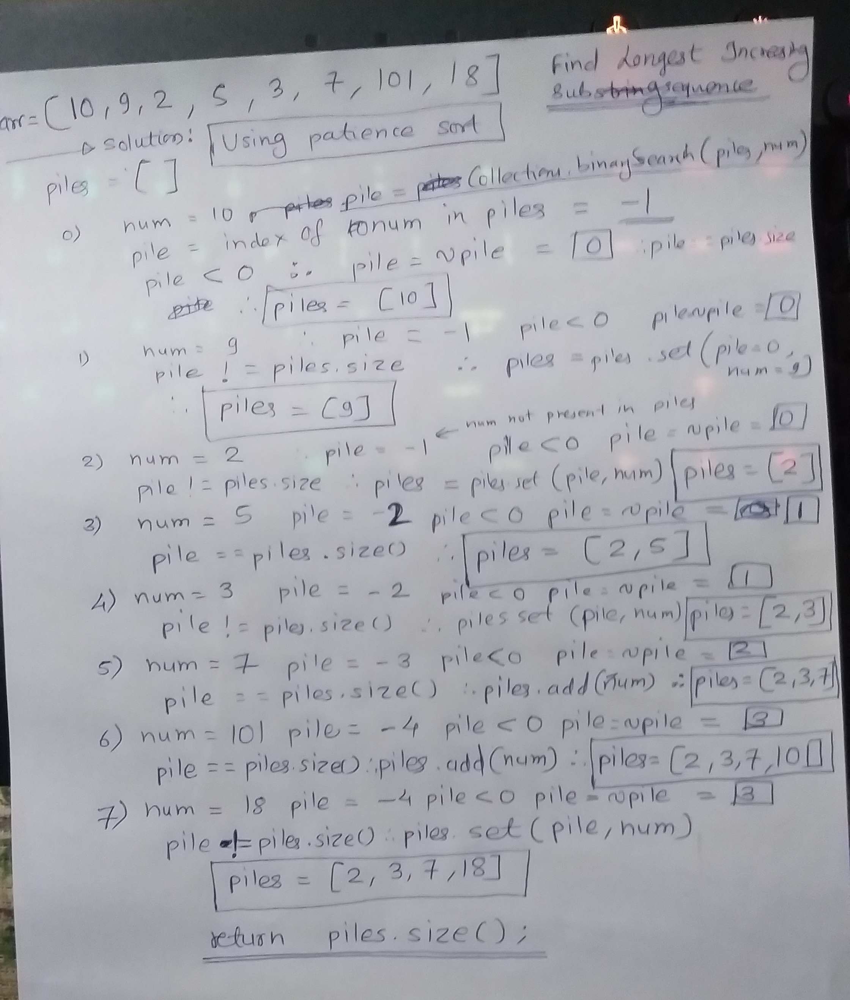

# How the algorithm works.
## We will use the patience sort algorithm for solving this problem in efficient way.

- We will initialize one piles ArrayList with zero elements. 
- Then we will go through every element in the given array. For every element, we will do following steps:  
	1. Use `Collections.binarySearch(arrayList, num);` to get the of the number if that number is present in the piles ArrayList. If number is present then it will return the index of the element.
	   If the number is not present in the piles ArrayList then the `Collections.binarySearch()` function will return a negative value and that negative value will tell us the required position of that element in the piles ArrayList.  
    2. If number is not present in the piles ArrayList then `Collections.binarySearch()` function will return a negative number. 
	   If we take the ones complement of this negative number, then we will get one positive number and this number is the expected position of that number in the piles ArrayList.
	   `expected position in ArrayList = ~ Collections.binarySearch(piles, num);`  
	   If the number is present then we don't need to take the ones complement of the number. We will take ones complement only if the value if negative. If number is present then `Collections.binarySearch()` will return 0.  
	3. After taking ones complement, if the index (expected position) that we get is equal to the size of piles ArrayList then we will add the number to the piles ArrayList. Else we will set the element at the expected index in the piles ArrayList to the current number.  
	4. Finally, the piles ArrayList contains the longest increasing subsequence.  
	5. Return the size of the piles ArrayList. That will be the length of the longest increasing subsequence.  

	## Example

	